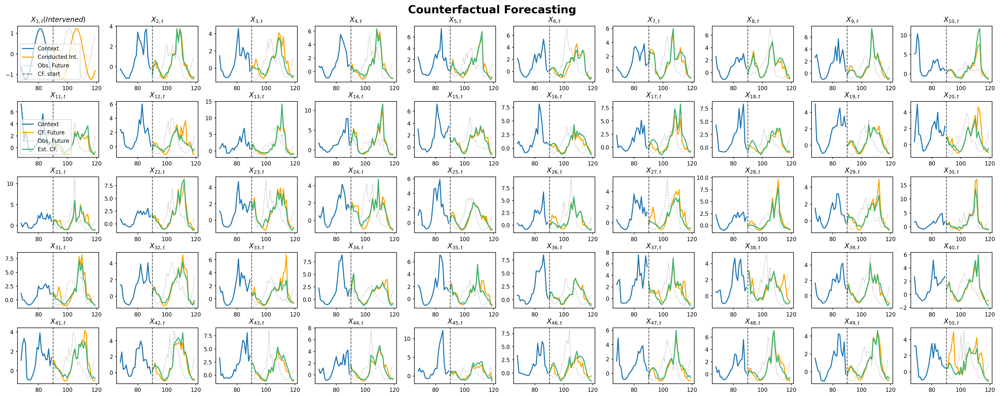

# DoFlow: Flow-based Generative Models for Interventional and Counterfactual Forecasting on Time Series

This repository contains the official implementation of the paper **"DoFlow: Flow-based Generative Models for Interventional and Counterfactual Forecasting on Time Series"**, accepted at **ICLR 2026**.

## 📄 About

**DoFlow** is a flow-based generative framework capable of unified **observational**, **interventional**, and **counterfactual** forecasting on time series data. By modeling the temporal dynamics of causal DAGs, DoFlow enables researchers to answer **"what-if"** questions for complex dynamical systems.

## Simulated Data
We simulated data that follows four causal DAG structures, including both linear-additive and non-linear-non-additive structures. The datasets are provided. Below is an example of counterfactual inference on a chain DAG structure (depicted in Fig. 7 of the paper):

<p align="center">
  
</p>

**Counterfactual forecasting (Chain, nonlinear).** 
Node $X_{1,t}$ is intervened. **Orange** denotes the true counterfactual future; **dotted gray** denotes the original (non-intervened) future. DoFlow produces a single counterfactual forecast (**green**) that closely matches the true counterfactual trajectory, even when it differs substantially from the original future.  

## Causal Effects Data Preparation

### Cancer Treatment Benchmark (Section 5.3)

For the experiments conducted in **Section 5.3 (Cancer Treatment Outcomes)**, we utilize the benchmark dataset established by **Bica et al. (2020)**.

**Step 1: Download the Data**  
You can download the necessary datasets via the link below:
[Download Data (Google Drive)](https://drive.google.com/drive/folders/1FA3HIi3snFY0If9AydZLhGYS0Es0p0xt?usp=sharing)


**Step 2: Organize the Directory**  
After downloading, please ensure the data is saved to the following directory structure:

```bash
.
├── data
│   └── cancer_treatment
│       └── <downloaded_files_here>
├── main_treatment.py
└── ...
```

### Credit: This benchmark is based on the following work:
```bash
@inproceedings{bica2020crn,
  title={Estimating counterfactual treatment outcomes over time through adversarially balanced representations},
  author={Bica, Ioana and Alaa, Ahmed and Jordon, James and van der Schaar, Mihaela},
  booktitle={International Conference on Learning Representations},
  year={2020}
}
```

## Usage
For improved readability and ease of reproduction, we have consolidated the core functions into standalone scripts.

### General Simulation & Experiments
To reproduce the main synthetic experiments or explore the model structure:
```bash
python main_simulation.py
```

### Cancer Treatment Experiments
Once the data is set up in data/cancer_treatment, you can run the treatment effect estimation experiments:
```bash
python main_treatment.py
```

## Citation
If you find this code or paper useful for your research, please cite our work:
```bash
@inproceedings{wu2026doflow,
  title={DoFlow: Flow-based Generative Models for Interventional and Counterfactual Forecasting on Time Series},
  author={Wu, Dongze and Qiu, Feng and Xie, Yao},
  booktitle={International Conference on Learning Representations},
  year={2026}
}
```
